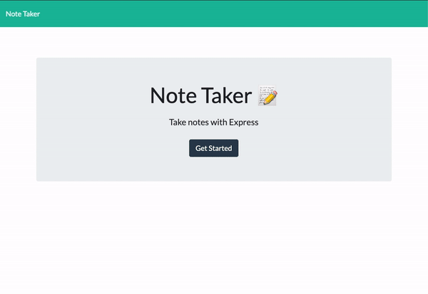

# ExpressJS Note Taker

## Objective

Modify back end code using Express.js to create a Note Taker application that can be used to write, save, and retrieve note data from a JSON file. 

## Table of Contents

* [Objective](#objective)
* [User Story and Criteria](#user-story-and-criteria)
* [Mock-Up](#mock-up)
* [Tools Implemented](#tools-implemented)
* [Installation](#installation)
* [Challenges](#challenges)
* [Additional Resources](#additional-resources)

## User Story and Criteria

```
AS A small business owner
I WANT to be able to write and save notes
SO THAT I can organize my thoughts and keep track of tasks I need to complete

GIVEN a note-taking application
WHEN I open the Note Taker
THEN I am presented with a landing page with a link to a notes page
WHEN I click on the link to the notes page
THEN I am presented with a page with existing notes listed in the left-hand column, plus empty fields to enter a new note title and the note’s text in the right-hand column
WHEN I enter a new note title and the note’s text
THEN a Save icon appears in the navigation at the top of the page
WHEN I click on the Save icon
THEN the new note I have entered is saved and appears in the left-hand column with the other existing notes
WHEN I click on an existing note in the list in the left-hand column
THEN that note appears in the right-hand column
WHEN I click on the Write icon in the navigation at the top of the page
THEN I am presented with empty fields to enter a new note title and the note’s text in the right-hand column
```

## Video Walkthrough

The following video demonstrates the functionality of the Note Taker application:



## Tools Implemented

* Express.js
* Generate Unique ID npm
* Heroku

## Installation

* `npm install express`
* `npm install generate-unique-id --save`

## Challenges

* Preventing GET /api/notes response from returning HTML vs. JSON file. <br>
    **Solution:** Removed API and HTML routes from server.js file and created routes directory with apiRoutes.js file and htmlRoutes.js file.

## Additional Resources

* [How to Make GET request with Express.js to Local File](https://stackoverflow.com/questions/47236927/how-to-make-get-request-with-express-js-to-a-local-json-file/47237111)
* [HTTPErrorResponse SyntaxError: Unexpected token < in JSON at position 0](https://www.xspdf.com/resolution/51583757.html)
* [Remove Array Element Based on Object Property](https://stackoverflow.com/questions/15287865/remove-array-element-based-on-object-property)
